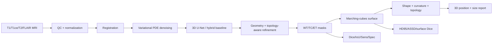

# BrainTumor Geometry: An Applied Mathematics Research Project

**Geometry processing · image processing · variational PDEs · multimodal MRI · 3D deep learning · geometric deep learning · topology · differential geometry · shape analysis**

> Research software for mathematical study of brain-tumor segmentation and geometry from multimodal MRI. It is **not a medical device** and must not be used for diagnosis or treatment decisions.

## Research objective
Build an end-to-end, mathematically interpretable pipeline that maps multimodal MRI volumes (T1, T1ce, T2, FLAIR) to tumor masks and then to quantitative 3D geometry: surface meshes, position within the brain, volume ratios, surface distances, topology, curvature, compactness, principal axes and uncertainty.

### Central hypothesis
Boundary- and topology-aware objectives combined with variational preprocessing and geometric post-analysis can improve geometric fidelity of tumor segmentations beyond optimizing voxel overlap alone.

## Research questions
1. How do variational PDE denoisers affect tumor-boundary fidelity?
2. Can surface-aware and topology-aware losses reduce HD95 without sacrificing Dice/IoU?
3. Which MRI modality combinations are most robust to missing/degraded sequences?
4. Can a mesh/graph representation improve shape classification or boundary refinement?
5. Which differential-geometric descriptors separate smooth, compact masses from irregular/infiltrative shapes?
6. How stable are volume, surface area, centroid and curvature measurements under segmentation perturbations?
7. How should tumor position be expressed relative to whole-brain geometry without overclaiming anatomical localization?

## Pipeline



## What is measured?
- **Overlap:** Dice, IoU/Jaccard
- **Detection:** sensitivity/recall, specificity, precision
- **Surface:** HD95, ASSD, mean surface distance
- **Size:** tumor volume, brain volume, tumor/brain ratio, bounding-box occupancy
- **Position:** centroid and normalized coordinates relative to the brain bounding box; coarse left/right, anterior/posterior, superior/inferior descriptors
- **Shape:** surface area, sphericity, compactness, elongation, principal axes
- **Topology:** connected components, Euler characteristic, optional persistent-homology features
- **Differential geometry:** vertex normals and discrete mean-curvature proxy

## Repository map
- `src/neurogeo/` — reusable research code
- `notebooks/` — 10 reproducible research notebooks
- `configs/` — experiment configurations
- `docs/` — mathematical and experimental documentation
- `figures/` — workflow, curves, MRI slices, 3D renders, GIF
- `experiments/` — synthetic demonstration logs and result tables
- `tests/` — unit tests for metrics and geometry
- `scripts/` — CLI demos and report generation

## Quick demo
```bash
python -m venv .venv
source .venv/bin/activate
pip install -r requirements.txt
python scripts/run_synthetic_demo.py --out outputs/demo
pytest -q
```

## Dataset strategy
The repository does not redistribute patient MRI. Use official BraTS access or another appropriately licensed dataset. A synthetic 3D phantom generator is included for unit tests, tutorials and CI.

## Generated visual outputs
The pipeline generates multimodal MRI panels, training/validation metric curves, radial shape histograms, 3D tumor surfaces, tumor-within-brain views and an animated 3D reconstruction. See `figures/README.md` for the reproducible asset inventory.

## Research branches
Ten research branches are included in the git history, each isolating one line of investigation. See `docs/BRANCH_STRATEGY.md`.

## Scientific integrity
All figures and CSV results shipped in this repository are **synthetic demonstration outputs**, not claimed clinical performance. Real-data numbers must be produced by running the locked protocol on an authorized dataset.

## Citation
See `CITATION.cff`.
